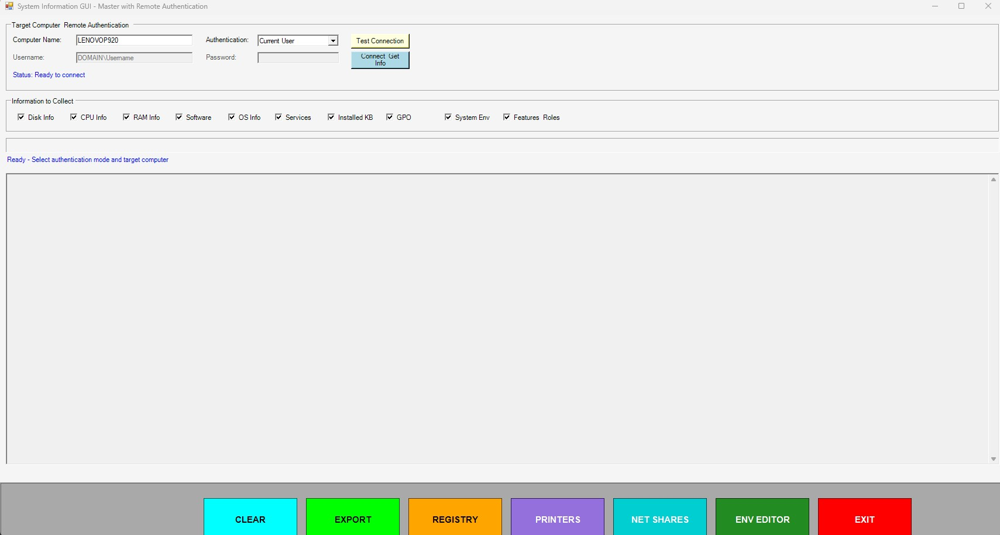

# SystemInfoGUI-Master Feature Documentation

**Author:** Roberto Raimondo - IS Senior Systems Engineer II
**Project:** Enterprise System Analysis Tool  

## 🔧 Complete Feature Reference Guide

### Analysis Categories (All Pre-Flagged)

#### 1. Disk Information
- **Complete Disk Analysis:** All drives with usage statistics
- **Partition Details:** File systems, sizes, and available space
- **Drive Types:** Local, network, removable drive categorization
- **Health Monitoring:** Disk usage percentages and capacity planning

#### 2. CPU Information  
- **Processor Details:** Model, architecture, and specifications
- **Core Analysis:** All CPU cores with individual performance metrics
- **Cache Information:** L1, L2, L3 cache details and memory hierarchy
- **Performance Metrics:** Clock speeds, utilization, and capabilities

#### 3. RAM Information
- **Memory Usage:** Total, used, and available memory statistics  
- **Slot Configuration:** Physical memory slots and module details
- **Speed Analysis:** Memory speeds, timing, and performance characteristics
- **Configuration Details:** Memory type, capacity, and system limits

#### 4. Software Inventory
- **Complete Application List:** ALL installed software without limits
- **Professional Tables:** Name, version, publisher, install date
- **No Truncation:** Shows every installed application on the system
- **Statistical Summary:** Total applications count and categorization

#### 5. Operating System Information
- **OS Details:** Version, build, architecture, and configuration
- **System Configuration:** Boot time, uptime, and system settings
- **User Account Information:** Current user and domain details
- **Regional Settings:** Locale, time zone, and language configuration

#### 6. Services Analysis
- **Complete Service Inventory:** ALL system services without limits
- **Service Categorization:** Running, Stopped, and Disabled services
- **Smart Descriptions:** Service descriptions truncated for readability
- **Professional Formatting:** Status, start type, and service details

#### 7. Windows Updates (KB)
- **Complete Update History:** ALL installed Windows updates
- **Update Statistics:** Total counts and categorization by type
- **Professional Presentation:** KB numbers, descriptions, and install dates
- **Security Analysis:** Critical updates and security patch tracking

#### 8. Group Policy Objects (GPO)
- **Policy Analysis:** Complete Group Policy configuration review
- **Security Settings:** Local and domain policy analysis
- **Administrative Templates:** Policy settings and configurations
- **Compliance Reporting:** Policy compliance and security assessment

#### 9. System Environment
- **Environment Variables:** ALL system and user variables
- **PATH Analysis:** Complete PATH variable breakdown and validation
- **System Paths:** Key directories and configuration paths
- **Framework Configuration:** PowerShell and .NET framework settings

#### 10. Features & Roles
- **Windows Features:** All Windows features via DISM analysis
- **Optional Features:** Enabled/disabled feature breakdown
- **Server Roles:** Server roles and features (if applicable)
- **Windows Capabilities:** Modern Windows 10/11 capabilities

### Interactive Management Interfaces

#### Environment Variable Editor
- **Full GUI Interface:** Professional Windows Forms interface
- **Complete CRUD Operations:**
  - **Add Variables:** Create new environment variables
  - **Modify Variables:** Edit existing variable values
  - **Delete Variables:** Remove unwanted variables
  - **Scope Selection:** Choose User or System scope
- **ListView Display:** Professional data presentation with sorting
- **Real-time Updates:** Immediate system integration and updates
- **Error Handling:** Comprehensive validation and error reporting

#### Comprehensive Printer Management
- **Printer Inventory:**
  - Complete list of all installed printers
  - Printer status (Ready, Offline, Error) tracking
  - Printer types and location information
  - Real-time printer condition monitoring
- **Print Queue Analysis:**
  - Active print jobs monitoring
  - Job status and document names
  - Queue management and troubleshooting
  - Print job history and statistics
- **Driver Management:**
  - Complete printer driver inventory
  - Driver versions and compatibility information
  - Environment specifications and requirements
  - Driver troubleshooting and diagnostics
- **Service Monitoring:**
  - Print spooler service status tracking
  - Service configuration and settings
  - Automatic problem detection and alerts
  - Service health assessment and recommendations
- **Interactive Features:**
  - **Refresh Analysis:** Real-time printer status updates
  - **Export Results:** Save printer analysis to documentation files
  - **Test Page Printing:** Send test pages to selected printers
  - **Professional Display:** Formatted tables with complete information

#### Network Shares Management
- **Local SMB Shares:**
  - Complete SMB shares inventory with paths
  - Share names, descriptions, and access details
  - Professional table formatting for easy reading
  - Total shares count and status information
- **WMI Network Shares:**
  - Comprehensive WMI shares analysis
  - Share type categorization (Disk, Print, IPC, Admin)
  - Detailed path and description information
  - Administrative and hidden share detection
- **Mapped Network Drives:**
  - All currently mapped network drives
  - Drive letters and remote UNC paths
  - Size and free space information with statistics
  - Drive usage analysis and capacity planning
- **Interactive Drive Mapping:**
  - **Drive Letter Selection:** Choose from available letters (Z: to E:)
  - **Network Path Input:** Enter UNC paths for resources
  - **Persistent Connections:** Option to reconnect at sign-in
  - **Error Handling:** Comprehensive mapping error reporting
  - **Auto Refresh:** Updates analysis after successful operations
- **Share Permissions Analysis:**
  - **Share Selection:** Choose from available local shares
  - **Permission Details:** Account names and access rights
  - **Access Control:** View control types and security settings
  - **Security Analysis:** Comprehensive share security overview
- **SMB Configuration:**
  - SMB client configuration analysis and settings
  - Connection limits, timeouts, and performance options
  - Bandwidth and multichannel configuration
  - SMB server status and configuration (if available)
- **Network Adapter Information:**
  - Active network adapter monitoring
  - Interface descriptions and link speeds
  - Physical adapter status and capabilities
  - Network performance and connection analysis

#### Remote Authentication System
- **Credential Management:**
  - Username and password authentication
  - Secure PSCredential object handling
  - Credential validation and testing
  - Automatic credential cleanup and security
- **Connection Testing:**
  - Test remote computer connectivity
  - Validate WinRM and CIM session capability
  - Network connectivity verification
  - Authentication success confirmation
- **Session Management:**
  - Automatic CIM session creation and management
  - Secure remote command execution
  - Session cleanup and resource management
  - Error handling and recovery procedures

### Technical Implementation Details

#### Data Collection Methods
- **WMI Queries:** Windows Management Instrumentation for system data
- **CIM Sessions:** Common Information Model for remote management
- **Registry Access:** Direct registry queries for detailed configuration
- **PowerShell Cmdlets:** Native PowerShell commands for comprehensive analysis
- **DISM Integration:** Deployment Image Servicing and Management for features
- **Service APIs:** Windows service management and monitoring APIs

#### Professional Data Presentation
- **ASCII Table Formatting:** Professional column alignment and spacing
- **Smart Truncation:** Optimized text truncation for readability
- **Statistical Summaries:** Complete counts and categorization
- **Status Indicators:** Clear status messaging with color coding
- **Export Capabilities:** Professional documentation export functionality

#### Error Handling and Reliability
- **Comprehensive Exception Handling:** Try-catch blocks for all operations
- **User Feedback:** Clear error messages and status updates
- **Graceful Degradation:** Continued operation when individual components fail
- **Resource Management:** Automatic cleanup and resource disposal
- **Validation:** Input validation and sanitization for security

#### Performance Optimization
- **Efficient Queries:** Optimized WMI and CIM queries for speed
- **Background Processing:** Non-blocking operations for responsive UI
- **Memory Management:** Efficient memory usage and garbage collection
- **Caching:** Intelligent caching for repeated operations
- **Parallel Processing:** Multi-threaded operations where appropriate

### Export and Documentation Features

#### Export Capabilities
- **Timestamped Reports:** All exports include generation timestamps
- **Professional Formatting:** Clean, readable output formatting
- **Complete Data:** No truncation or data loss in exports
- **Multiple Formats:** Text files with proper encoding
- **Organized Structure:** Logical organization of exported data

#### Documentation Standards
- **Professional Headers:** Clear section headers and organization
- **Statistical Summaries:** Complete counts and analysis statistics
- **System Information:** Computer name, generation time, and context
- **Error Reporting:** Clear documentation of any issues or limitations
- **Compliance Ready:** Enterprise-ready documentation for auditing

---

*Complete feature documentation for SystemInfoGUI-Master v1.0*  

*All features tested and verified operational - October 2, 2025*

